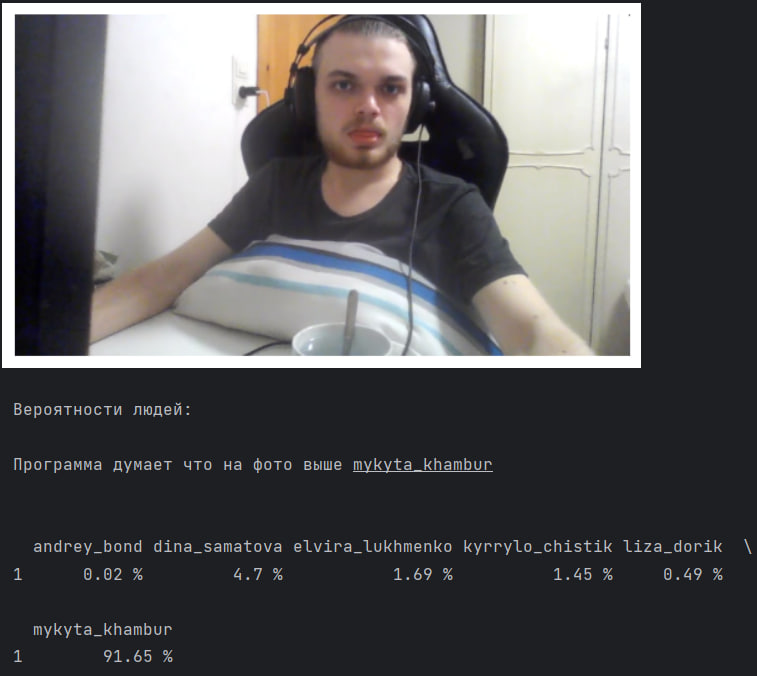

# Face Recognition на Python

Этот проект представляет собой модель распознавания лиц, разработанную на Python с 
использованием библиотеки для компьютерного зрения. 

## Описание

Проект предоставляет простой и эффективный способ распознавания лиц 
с использованием методов компьютерного зрения и алгоритма haar. 
Он включает в себя следующие ключевые функции:

- **Обработка загруженных фото:** Возможность обнаружения лиц на изображениях и создание дата сета.
- **Идентификация лиц:** Возможность идентифицировать заранее известные лица из дата сета.
- **3 модели ML:** Отображение результатов обнаружения и идентификации лиц из дата сета.
- **Выбор наилучших результатов** Сохранение наилучшей модели для использования.

# Face Recognition на Python



Этот проект представляет собой систему распознавания лиц, разработанную на 
Python с использованием библиотеки для компьютерного зрения.

## Установка

1. Установить необходимые зависимости:

```python
pip install -r requirements.txt
```

## Использование

- Добавить изображения людей лица которых вы хотите распознавать, в папку data.
- Запустить скрипт для обнаружения и идентификации лиц. 
